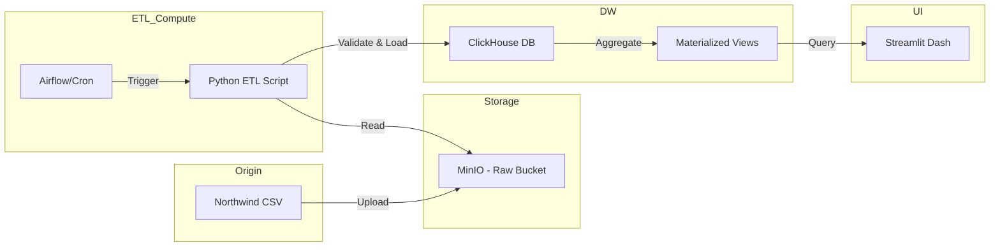

# Especificação da Arquitetura (RM-ODP)

Este documento descreve a arquitetura do sistema Northwind ETL seguindo as cinco visões do framework RM-ODP, integrando as ferramentas selecionadas para garantir confiabilidade e observabilidade.

---

## 1. Visão de Negócio (Enterprise Viewpoint)
**Objetivo:** Atender à necessidade de KPIs confiáveis para a diretoria.
- **Escopo:** Automação do ciclo de vida do dado, da ingestão ao dashboard.
- **Políticas de Negócio:** 
    - Integridade acima de latência.
    - Idempotência obrigatória em todas as camadas.
    - Observabilidade total do fluxo.

## 2. Visão de Informação (Information Viewpoint)
**Fluxo de Dados:**
1. **Landing Zone (MinIO):** Armazenamento de arquivos CSV brutos (Raw).
2. **Staging/Processing (Python):** Validação, limpeza e normalização.
3. **Analytics Layer (ClickHouse):** Armazenamento dimensional (Fatos/Dimensões) e visões materializadas (Materialized Views).
4. **Presentation (Streamlit):** Consumo de KPIs agregados.

## 3. Visão Computacional (Computational Viewpoint)
**Componentes e Responsabilidades:**
- **Orquestrador (Airflow/Cron):** Gatilho diário (03:00 AM) e gerenciamento de dependências.
- **ETL Engine (Python):** Script de ingestão que lê do MinIO, valida esquemas e carrega no ClickHouse.
- **DW Engine (ClickHouse):** Execução de transformações SQL e persistência otimizada para consultas analíticas.
- **Interface (Streamlit):** Visualização de dados conectada diretamente ao ClickHouse.

## 4. Visão de Engenharia (Engineering Viewpoint)
**Stack Tecnológica e Integração:**
- **Armazenamento:** MinIO (S3-compatible API).
- **Processamento:** Python (Pandas/Polars) para lógica de quarentena e validação.
- **Banco de Dados:** ClickHouse (Alta performance em agregações).
- **Orquestração:** Apache Airflow para DAGs complexos ou Cron para simplicidade inicial.
- **Dashboards:** Streamlit (Python-based) para prototipagem rápida e interativa.

**Diagrama de Fluxo Logístico:**

## 5. Visão Tecnológica (Technology Viewpoint)
| Camada | Tecnologia | Motivação |
|:---|:---|:---|
| **Storage** | MinIO | Compatibilidade S3, alta performance, open-source. |
| **Ingestão** | Python | Versatilidade, ecossistema rico de bibliotecas de dados. |
| **Banco de Dados** | ClickHouse | Velocidade extrema para queries OLAP e suporte nativo a Materialized Views. |
| **Orquestração** | Airflow | Gestão de falhas, retentativas e visualização de pipelines. |
| **Visualização** | Streamlit | Facilidade de desenvolvimento e integração nativa com Python. |

---

## Análise de Aderência (SRE/SWEBOK)
- **Confiabilidade:** O uso de Airflow garante retentativas automáticas. ClickHouse garante consultas rápidas para o SLA das 08:00 AM.
- **Auditabilidade:** Logs de Python e Airflow permitirão rastrear registros em quarentena.
- **Escalabilidade:** MinIO e ClickHouse escalam horizontalmente conforme o volume cresce.
